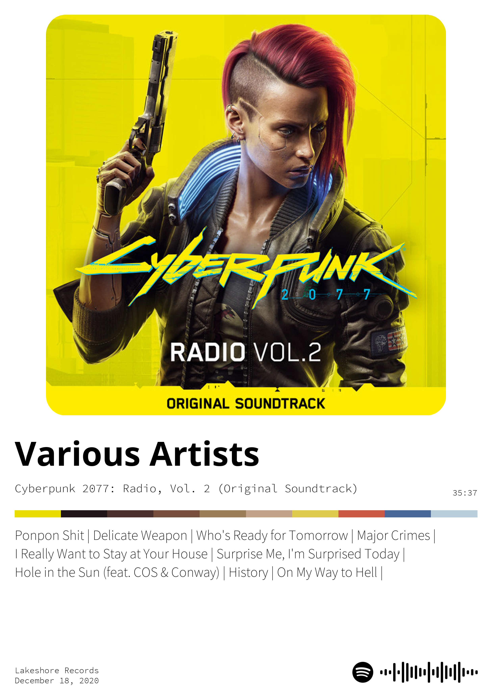
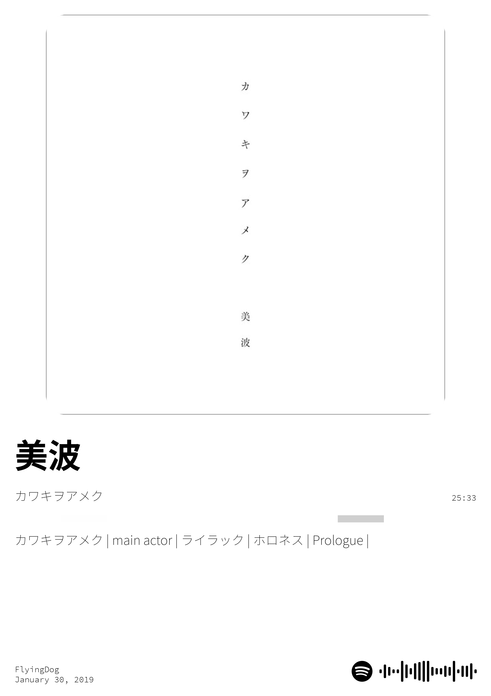

# Spotify Poster Generator

https://poster-generator.up.railway.app/

Does what it says on the tin.

Enter a (valid) Spotify album URL, receive a poster!

## Examples!

  

    <a href="https://open.spotify.com/album/1VGVJdmvOSRK2w9RKXk18A?si=f9df2e562e854eb7">
      <h3>Cyberpunk 2077 Radio, Vol 2</h3>
    </a>
    
  

  

    <a href="https://open.spotify.com/album/2oN5rPuojBnqH0uQMUMVAl?si=a5c84b40146e48d1">
      <h2>カワキヲアメク</h2>
    </a>
    
  

---

### Issues/Ideas
- [ ] Tracks vertical length scaling
- [ ] Drop down menu in main webpage to search for album
  
### Fixed Issues 🎉
- [x] Choose poster size
- [x] Special characters not supported
- [x] Better font
- [x] No checking for validity of URL
---
To run this for yourself locally, you'll need a .env file with the following values:
- SPOTIFY_SECRET = `your spotify secret code`
- SPOTIFY_ID = `your spotify client id`
- FLASK_SECRET = `your flask secret code`

---
Big thanks to @sudmike for contributing to the repository and coming up with ideas!

---
---
The website probably wont be up all the time, just email me if you need one.
